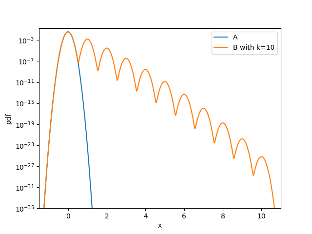

# Group Privacy for Deep Learning with Differential Privacy

Recently, I wanted to analyze the effect when multiple data samples are protected differentially private by the noise adding mechanism in moments accountant [1]. Surprisingly, I was not able to find this case in the literature. Maybe I missed it. In the end, I derived the required insights on my own, and I will share them here with a focus on implementation. The examples will be presented with [TensorFlow privacy](https://github.com/tensorflow/privacy). The results, however, apply to any other framework as well. If anyone already published the same ideas, I apologize. 

I will start with a short introduction to the problem and will extend the current state of literature with my insights. The target audience is supposed to be familiar with the differentially private stochastic gradient descent algorithm and differential privacy. 

**TL;DR:** The worst-case Gaussian mixture representing maximal privacy leakage can be extended to a more complex mixture distribution where the occurrence probabilities of the different sub-sampling events are described by the Hypergeometric distribution. Individual gradients are still clipped to length C. For protecting k samples with batch-size B and N training samples total, we need to compare 
```
A = N(0, sigma)
B = sum_{j=0}^{k} pmf(j,k,B,N) * N(j*C, sigma)
```
Python code illustrating the numerical privacy analysis is found [here](plots.py).

**Disclaimer:** I do not take any responsibility for actions taken based on the content published in this blog-post. 

## What is Deep Learning with Differential Privacy?

Abadi et al. [1] introduced moments accountant that allows training a set of parameters with stochastic gradient descent (SGD) such that the impact of a single sample in the training set differentially private. 

Differential privacy is a formalism that guarantees the protection of inputs (individual data samples) when processed by a mechanism (here, the output are the ML-model parameters/weights) such that the contribution of a single input is reasonably deniable. Usually, this is achieved by adding noise to blur individual contributions. Of course, this requires a certain amount of data. Else, the blurring of a single input could distort the result's usefulness to a degree of complete uselessness. From a formal perspective, differential privacy compares two datasets as input to mechanisms: one input D' that does contain the data sample in question and one dataset D that does not. Then, a differentially private mechanism is guaranteed to limit the maximal difference in outputs originating from processing any D or D' differing by one entry. A certain indistinguishability metric measures the difference, usually parametrized by epsilon and delta. Conceptually, we do not intend to protect a specific data sample but guarantee that the substitution of any single data sample is blurred. For more details, I refer to the corresponding literature, starting with [3].

The differentially private SGD (DP-SDG) algorithm [1] renders the model parameter differentially private to protect the training data. By clipping the L2-norm of the gradients of a single data sample to a constant C, it limits the individual impact. Then, it adds noise to the summed gradients of each batch to blur the contribution of a single data sample. The training works as follows on the model parameter theta and noising parameter sigma

Training-step t:

1. Sample samples for batch randomly from all available samples N: B <-- Poisson(N) 
2. compute gradient g_i(B_i, theta_t) for each data sample B_i in B
3. clip each gradient to C: gc_i = g_i / max(1, ||g_i||_2 / C)
4. sum and noise: gn_t = noise + sum_i gc_i   with  noise ~ N(0, sigma)
5. update model parameters: theta_t+1 = theta_t + lr * gn_t

The noise is drawn from a Gaussian distribution with mean zero and deviation sigma, lr denotes the learning rate.

For the privacy analysis, Abadi et al. [1] have shown that it can be reduced to the comparison of the following worst-case distributions, i.e., no other output theta_t of the training step t can have more privacy leakage than the comparison of the following two noise distributions:

```
A = N(0, sigma)
B = (1-q) * N(0, sigma) + q * N(C, sigma)
```

where q is the sampling probability that a data sample is contained in the processed batch, assuming Poisson sampling. As a side note: Poisson sampling, i.e, the assumption that the samples for each batch are drawn uniformly from all available samples, is uncommon in deep learning that usually iterates over the complete (possibly order-randomized) dataset. Maybe except for randomly sampled clients in federated learning. Still, Poisson sampling simplifies the privacy analysis significantly.

The intuition behind the A-B-reduction is the following: The contribution of a single sample cannot exceed C, because we clip them accordingly. The spherical symmetry of the added Gaussian noise allows us to rotate any gradient updates to a 1D axis spherically. 

Dataset D that does not contain the data sample will produce distribution A. The dataset D' that contains the sample will most likely produce A as well (with probability (1-q)) as the sample is only sampled for the processed batch with probability q. If it is sampled, it will produce *maximally* N(C, sigma) with probability q. As the added noise is monotonically falling from the center, any contribution C' < C of a data sample will lead to a larger overlap of the two distributions N(0, sigma) and N(C', sigma), and therefore induce less privacy leakage. 

This method is called 'sub-sampling' in literature. Different sampling methods than Poisson sampling have been examined as well, e.g., in [4].

Moments accountant [1,5] utilizes Renyi-divergences between these two worst-case distributions to bound the approximate-differential-privacy leakage (see [3]) of DP-SGD. I have shown in my work that there are tighter approximation methods that eventually add less devastating noise for the same privacy parameters [2]. Later in this post, I will apply the numerical tool ([Privacy Buckets](https://github.com/sommerda/privacybuckets)) based on [2,6] to obtain a numerical privacy analysis. 

## How to extend DP-SGD to protect k samples

Using the intuition from the previous section, I will derive a method to incorporate the protection of multiple samples. There are two key factors. First, we need to add broader noise to blur multiple contributions during training. Second, we need to extend the privacy analysis. I will present a tight analyzing method to obtain a suitable noise width sigma that requires additional tools. And I will provide an over-approximation compatible with the privacy leakage estimation tools available with TensorFlow privacy. 

From now on, the number of samples we intend to hide is denoted by k.

### The DP-SGD algorithm during training

The DP-SGD algorithm itself we do not need to change. But we need to enlarge the width of noise to blur k samples. The noise now needs to cover a sensitivity of k\*C, instead of only C. The clipping itself stays the same as we still need to limit individual contributions to C. The final width of noise (sigma) is set accordingly to reach the targeted epsilon and delta. Training with the same sigma as for protecting only one sample (k=1) will result in a higher privacy leakage. 

### The privacy analysis

Here, it gets tricky. We need to extend the worst-case distributions A and B accordingly. And we need to argue that the resulting distributions are actually worst-case. Moreover, the impact of the chosen sampling method grows. We cannot consider pure Poisson subsampling as we cannot draw the same protected sample twice within a single batch. We need to include sampling without replacement within a batch. Multiple batches are sampled with replacement, i.e., the population is reset again after a full batch is drawn.

As a start, we examine the case k=2, i.e., protecting two samples. Assume we want to protect samples s_1 and s_2 (which are arbitrary, we want to cover all of them simultaneously). For a batch with batch size B and the total number of samples N:

The probability of including the two samples in the batch is
```
Pr[s_1 and s_2 in B] = B / N * [ (B-1) / (N-1) ] 
```

The probability of including one of the two samples but not both in the batch is
```
Pr[s_1 or s_2 in B but not both] = 2 * (B / N) * [1 - B/(N-1)]
```

and the probability of including none is corresponding,
```
Pr[neither s_1 nor s_2 in B] = 1 - Pr[s_1 or s_2 in B but not both] - Pr[s_1 and s_2 in B] 
                             = [1 - B/N] * [1 - (B-1)/(N-1)]
```

For arbitrary k, this problem is equivalent to drawing exactly j samples possessing a binary attribute with a total of B draws from a population of total N samples from which k samples possess that binary attribute. This is a typical "urn problem" in combinatorics, described by the hypergeometric distribution ([Wikipedia](https://en.wikipedia.org/wiki/Hypergeometric_distribution)). Its probability mass function reads
```
pmf(j,k,B,N) = (k over j) * ( N - k over B - j) / ( N over B )
```
where (a over b) denotes the binomial coefficient. 

How do we now construct worst-case distributions with this knowledge? Well, with probability pmf(0,k,B,N), we do not have a single critical sample in the batch. With probability pmf(1,k,B,N), the critical samples can maximally divert the gradient update by C. With probability pmf(2,k,B,N), it is 2C, with pmf(3,k,B,N) it is 3C and so forth. The Gaussian noise we add is monotonically decreasing from the center, meaning any combination of j samples included in the batch which influence the gradient with C' < j\*C incur less privacy leakage than the maximal deviation of j\*C. This leads to the following worst-case distributions:

```
A = N(0, sigma)
B = sum_{j=0}^{k} pmf(j,k,B,N) * N(j*C, sigma)
```

With each invocation of a training step (each time we add noise), the privacy leakage increases. I literature, the privacy analysis of such multiple, composed outputs is called *composition* of privacy leakages.

### Analytical evaluation of resulting epsilon

Deriving the resulting epsilon for a specific target-delta analytically is tedious. One may try to derive expressions for the exact Renyi-divergence comparing A and B, and then using the Moments Accountant [1] to evaluate composition. Another way might involve the privacy loss distribution [2] that gives exact epsilons and deltas but is unlikely to provide a simple analytic expression for this specific case. I am going to do neither of them; I illustrate only numerical methods in the next section. 

## Implementation and numerical privacy analysis

First, I present a quick method that can be implemented in Keras using TensorFlow privacy that is a vast over-approximation. With already a low number of protected samples k, the usefulness (utility) decreases quickly. 

The second part will illustrate a more advanced numerical analysis method that delivers tight (epsilon, delta)-bounds. 

Python code illustrating the proposed methods and generating the plots can be found [here](plots.py).

### The I-am-using-keras-and-just-want-group-privacy-without-thinking method

If you have a working algorithm and want to include group privacy without fine-tuning a lot, you can switch a few lines of code and get your group privacy. However, this is a vast over-approximation resulting in quickly decreasing utility, even with small k.

We need to increase the noise we add. Following our intuition, k samples in our batch can maximally impact the gradients by k\*C. To protect this accordingly, we just add k times more noise than with k=1. Of course, one could do a more advanced privacy analysis and set the noise_multiplier accordingly (most likely lower than k\*noise_multiplier). Note that noise_multiplier = sigma / C.

Here an example of how to implement that in Keras for a simple MNIST model using TensorFlow privacy. Note the extension of the noise_mulitplier by k.
```python
model = Sequential([
    Dense(10, activation='relu', input_shape=(784,)),
    Dense(10, activation='softmax')])

new_noise_multiplier = k * noise_multiplier

optimizer = DPKerasSGDOptimizer(
    l2_norm_clip=l2_norm_clip,
    noise_multiplier=new_noise_multiplier,
    num_microbatches=microbatches,
    learning_rate=learning_rate)

loss = tf.keras.losses.CategoricalCrossentropy(from_logits=True, reduction=tf.losses.Reduction.NONE)

model.compile(optimizer=optimizer,
              loss=loss,
              metrics=['accuracy'])
```

And the resulting epsilon? Well, we can use TensorFlow privacy methods with a few adjustments. The epsilon computation mechanism considers subsampling according to the worst-case distributions

```
A = N(0, sigma)
B = (1-q) * N(0, sigma) + q * N(C, sigma)
```

The sensitivity is implicitly set to 1, not to the clipping constant C. This is the reason the 'relative noise'-sigma is used and then scaled up to C during training. We can bring our problem to the same shape by shifting all occurrences of combinations j at sensitivity j\*C to k\*C. This gives us 

```
q = sum_{j=1}^k hypergeom.pmf(j,k,B,N) = 1 - hypergeom.cdf(0,k,B,N)
```

with a sensitivity of k\*C. To scale the implicit sensitivity of k\*C to 1, we divide the new_noise_multiplier by k.

This will result in an upper bound for the privacy leakage (someone will prove that one day). The resulting `compute_epsilon` function from the tensorflow privacy examples looks then as follows
```python
from scipy.stats import hypergeom
def compute_epsilon(steps, k, N, new_noise_multiplier, B, target_delta=1e-5):
    """Computes epsilon value for given hyperparameters for more than one protected sample. Code is partially copied from tensorflow privacy project."""
    if noise_multiplier == 0.0:
        return float('inf')
    orders = [1 + x / 10. for x in range(1, 100)] + list(range(12, 64))
    q = 1 - hypergeom.cdf(0, N, k, B)  # This is a vast overapproximation!
    rdp = compute_rdp(
    	q=q,
    	# our sensitivity is not 1 but j*1. We scale the x-axis accoridngly by dividing the new_noise_multiplier by k
        noise_multiplier=new_noise_multiplier / k,
        steps=steps,
        orders=orders)
    # Delta is set to 1e-5 because MNIST has 60000 training points.
    return get_privacy_spent(orders, rdp, target_delta=target_delta)[0]
```
One may consider adapting the granularity of the generated orders to the current needs. 


### A proper (numerical) privacy analysis

This method is tighter than the previous proposal. Assuming the worst-case property of the distributions 

```
A = N(0, sigma)
B = sum_{j=0}^{k} pmf(j,k,B,N) * N(j*C, sigma)
```

We use the numerical privacy buckets tool [6] ([Github Repo](https://github.com/sommerda/privacybuckets)) to provide upper and lower bounds for (epsilon, delta). First, we generate the worst case distributions with sufficiently fine granularity such that the numerical errors are negligible:
```python
def get_worst_case_distributions(k, batch_size, N, sigma, truncation_multiplier=50, granularity=10000):
    width = sigma * truncation_multiplier
    # the points on the x-axis we generate discrete noise for.
    x = np.linspace(-width, width + k * sigma, int((2 * width + k * sigma) * granularity))

    # the first distribution
    A = norm.pdf(x, loc=0, scale=sigma)

    B = np.zeros_like(A)
    probs = hypergeom.pmf(np.arange(0, k + 1), N, k, batch_size)

    for j in range(k + 1):
        B += probs[j] * norm.pdf(x, loc=j, scale=sigma)

    A /= np.sum(A)
    B /= np.sum(B)  # normalise due to discretisation

    return A, B
```
If truncation_multiplier is sufficiently high, the truncated elements have negligible probability mass. The normalization to 1 is essential for the correct behavior of Probability Buckets.

We initialize privacy buckets with these distributions, compose to the number of required compositions, and compute the required epsilon for a given target delta.
```python
pb = PB(dist1_array=A,  # distribution A
        dist2_array=B,  # distribution B
        **kwargs)

# input can be arbitrary positive integer, but exponents of 2 are numerically the most stable
pb_composed = pb.compose(number_of_compositions)

# some PB internals, not really relevant
max_eps = (pb_composed.number_of_buckets // 2 ) * pb_composed.log_factor

epsilon = scipy.optimize.bisect(lambda eps: pb_composed.delta_ADP_upper_bound(eps) - target_delta, 0.0001, max_eps)
```

Privacy buckets can also provide Renyi-moments, if anyone intends to use moments accountant. 

Using the proposed numerical methods, I generated a few plots, all with C=1. The numbers are inspired by a typical DP-SGD trained classifier for MNIST. The code for the plots you can find [here](plots.py).

First, an example of such two worst-case distributions with k=5 and sigma = 0.1 for illustration purposes. Warning: do not use a sigma of 0.1 in your DP-SGD algorithm unless you know what you do!



Here, a comparison between the first method using Renyi-moments and Moments Accountant (RDP-method) and the Privacy Bucket evaluation (PB-method) for sigma=1. For the over-approximating method (RDP-method), lines for k=5 start higher than the plotting area. A typical MNIST example is trained with 2^12 - 2^14 compositions. 


Note that the RDP-method produces infeasible epsilons already for k=3.

Finally, a plot varying over k for different sigmas, fixing the number of compositions to 2^14.


## References

[1] Abadi, Martin, et al. "Deep learning with differential privacy." CCS 2016. 

[2] Sommer, David M.,et al. "Privacy loss classes: The central limit theorem in differential privacy." PoPETS 2019.2 2019.

[4] Balle, Borja, Gilles Barthe, and Marco Gaboardi. "Privacy amplification by subsampling: Tight analyses via couplings and divergences." NeurIPS 2018.

[5] Mironov, Ilya. "Rényi differential privacy." CSF 2017.

[6] Meiser, Sebastian, et al. "Tight on budget? tight bounds for r-fold approximate differential privacy." CCS 2018.
